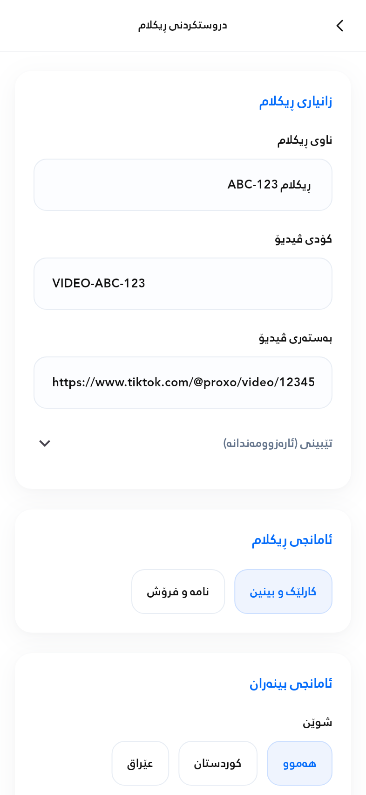
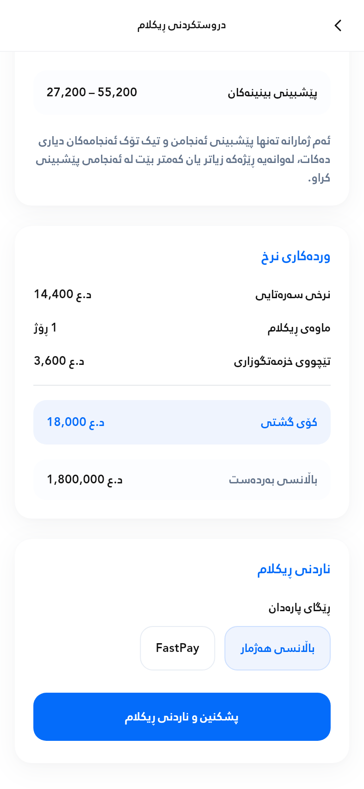
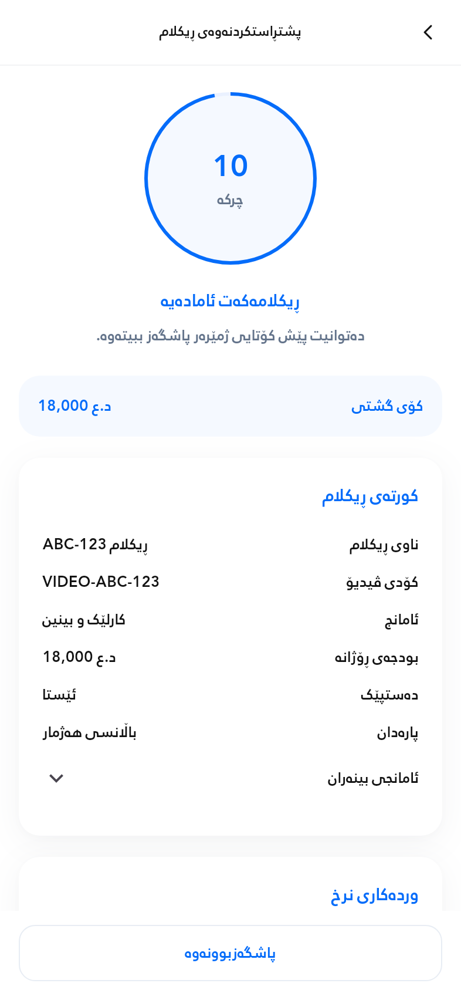
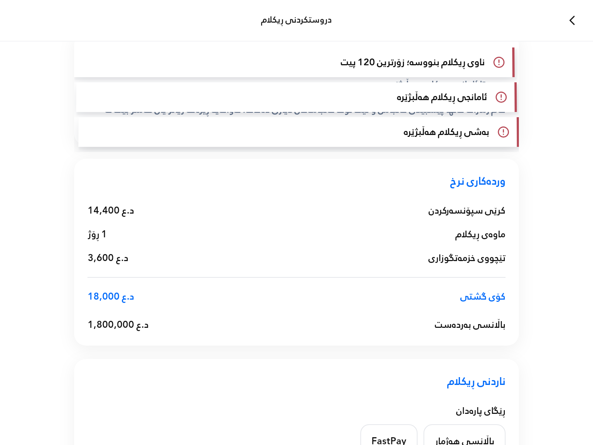

# Proxo advertisement creation implementation

Implemented and verified on 2026-10-03. Production code uses the existing Supabase project, authentication, contact-page builder, pricing rules, wallet/ledger, scheduling fields and canonical thumbnail function. Test fixtures exist only in tests.

## Requirement coverage

| Requirement | Implementation |
| --- | --- |
| Transaction History | Removed its bottom navigation only. Kept AppBar, refresh, back navigation, queries, receipt routes and card design. |
| Nine Create Ad sections | Rebuilt information, objective, audience, budget/duration, scheduling, coupon, forecasts, existing price details and submission. White surfaces, shared blue, soft shadows, responsive wrapping and subtle animations. |
| Video information | Name and authorization code remain required. The existing required TikTok URL stays as supporting input because processing and thumbnail generation depend on it. Optional customer notes remain supported. |
| Objectives and contact pages | Exactly views/engagement and messages/sales. Contact selection is shown and required only for messages. Loads the authenticated user's pages; the existing builder returns a newly created page without losing the form. |
| Targeting | All/Kurdistan/Iraq, All/Male/Female in RTL order with natural widths. Existing multi-select age groups, category slugs and All/iPhone/Android values are preserved. |
| Budget and duration | Existing USD steps 10, 20, 50, 100, 200, 500, 1000; existing duration 1–7 days. Sliders recompute daily × days from source values, without multiplying a previous total. |
| Scheduling | Earliest start or future date/time, in the existing Baghdad clock convention. Future values are frozen during confirmation; earliest start is set from the server clock at final registration. |
| Coupons | Existing server validation, restrictions, expiration and usage rules. Invalidated discounts disappear on repricing. No duplicate coupon implementation. |
| Forecasts | Configured objective-specific CPM ranges remain internal. Uses advertising delivery budget excluding the existing service fee; discounts do not reduce delivery. Shows views for both goals and contact-page clicks for messages, with the exact requested disclaimer. |
| Pricing and balance | One Create Ad price section using server quotes and actual available balance. `د.ع`, LTR numbers, negative green coupon row highlighting label and value, blue total. Existing level discounts remain supported. Frozen checkout preserves the exact server-quoted IQD amount. |
| Confirmation | Dedicated screen with animated ring/seconds, immediately visible total, ad summary, targeting details, pricing and fixed cancellation button. `PROXO_AD_CONFIRM_SECONDS` configures the default 10 seconds. |
| Cancellation and lifecycle | Cancelling or backing out during countdown makes no financial request and preserves the form. Backgrounding pauses the countdown. Final processing blocks cancellation and repeated submissions. |
| Secure registration | Authenticated atomic `pa_submit_ad` wraps existing `pa_create_ad`. Ad, wallet debit, ledger entry, coupon usage and idempotency receipt commit together or roll back together. Existing publishing statuses and workflows remain separate. |
| Durable retries | Frozen request and UUID are stored on-device before the final request. Status lookup recovers a committed result. Same-key requests serialize on a transaction advisory lock; existing wallet row locks protect concurrent balance changes. Client single-flight protection blocks competing submissions. Unreadable pending state blocks a fresh checkout. |
| FastPay | Existing gateway, transaction-credit workflow, QR and deep link are preserved. Deterministic order ID resumes payment; approved, paid, wallet-credited receipt is required. If registration fails after payment, the credit remains in the wallet and editing switches to account-balance payment. |
| Validation notifications | Form-only, sharp, compact cards with subtle perspective/shadows, staggered entry/exit and three readable layers. Errors deduplicate by field; queued cards receive five seconds when visible. Notifications ignore pointers. |
| Typography and direction | New screens inherit Rabar and normal w400 theme styles with no hardcoded font sizes or artificial scaling. Shared receipt-based content direction covers app labels, cards, fields, IDs, dates, numbers, rich text and generated contact HTML. Raw inputs, storage and copied values stay unchanged. |
| Shared design and functionality | Reuses receipt AppBar/tokens and shared form/pricing components. Existing Ad Details/receipt geometry and PDF export remain intact. Successful creation returns to the Ads tab. |

## Pricing and forecasting decisions

The established service fee is **included** in the selected gross budget: 80% delivery + 20% service. It is not added again. Conversion and discounts come from the existing server rules; the client introduces no exchange rate.

View-rate history is accepted only from at least five comparable TikTok campaigns with sufficient, valid recent impressions. Without reliable history, view rates use provisional 60–80% bounds. Stored campaign clicks do not prove contact-page attribution, so contact-click rates use explicitly provisional 0.5–1.2% bounds. The interface identifies provisional estimates and never displays CPM.

## Verification actually performed

| Check | Result |
| --- | --- |
| Complete Flutter test suite | **226 passed**, including model, Flutter engine widget/runtime, auth regression, receipt layout and PDF export tests. |
| Responsive Create Ad | 280, 393, 430 and 768 dp at normal and 1.5 accessibility text scale; no rendering exceptions. |
| Responsive confirmation | 280, 393 and 768 dp with long mixed values and 1.5 accessibility text scale; cancellation stays visible. |
| Interactive workflow | Inputs, objective-dependent contact selection, page creation/return, supported targeting, sliders, repeated duration changes, coupon application/expiration, date/time controls, invalid/insufficient forms, countdown, cancellation, background pause, success and recovery. |
| Financial client transport | Actual Supabase client with controlled HTTP transport tested interrupted responses, same-key recovery, concurrent repeated calls, conflicting pending requests, insufficient funds, expired scheduling, unavailable status lookup and paid FastPay registration failure. No real gateway payment was made. |
| Live Supabase transaction tests | **22 passed** against the deployed RPCs. Fixtures were rolled back and absence of leftover users/ads/wallets/ledger/retry records was checked. See `ad_submission_backend_checks.json` and `supabase/tests/ad_submission_rollback.sql`. |
| RPC/private-table access | New RPCs execute for authenticated users, not anonymous users. Fixed empty search paths. Private retry schema/table is inaccessible to anonymous and authenticated roles. |
| Bidirectional source audit | All application Text constructors use the shared helper; native editable fields carry wrapper-controlled direction; decoration strings are direction-aware widgets. No unhandled source gaps. |
| Analysis | No compile errors or diagnostics introduced by this implementation. Existing repository warnings/info remain, so full analysis is not globally warning-free. |
| Builds | Linux Flutter bundle succeeded. [GitHub Android release AAB build](https://github.com/Zana-Sponsor/proxobalance/actions/runs/37099745141) succeeded for implementation commit `840b4a07aae89c36828b99416e07165bbabd7126`; `proxo-release-aab` was uploaded. |
| Visual inspection | Production-widget renders reviewed for form, pricing, confirmation and validation stack. Existing receipt/history/PDF tests passed. |

Reproduce with Flutter 3.47.2:

```sh
flutter pub get
flutter test --no-pub
flutter analyze --no-pub lib test
flutter build bundle --no-pub --target-platform=linux-x64
```

The migration `20261003043057_ad_confirmation_idempotency.sql` was applied to the connected Supabase project. New private retry records intentionally have no client policies; authenticated security-definer RPCs enforce `auth.uid()` and are the only client access path. Relevant advisor explanations: [private table with no client policy](https://supabase.com/docs/guides/database/database-linter?lint=0008_rls_enabled_no_policy) and [authenticated security-definer functions](https://supabase.com/docs/guides/database/database-linter?lint=0029_authenticated_security_definer_function_executable).

## Verification still unavailable

- Physical Android/iOS sessions and an iOS release build: mobile device/macOS tooling are unavailable. Local Android SDK is unavailable; the Android release AAB was successfully built by GitHub Actions.
- Web build: this mobile project has no configured web target; none was added.
- A real FastPay payment, live TikTok publication/thumbnail creation for a new paid ad, and a signed-in device end-to-end run: required payment/device credentials were unavailable.
- Parallel financial requests against a dedicated test database: database replay/rollback and client concurrency were tested; a multi-connection live financial load test was not performed.

These limitations are verification gaps, not claimed passing tests. No real account was charged during testing.

## Rendered previews





