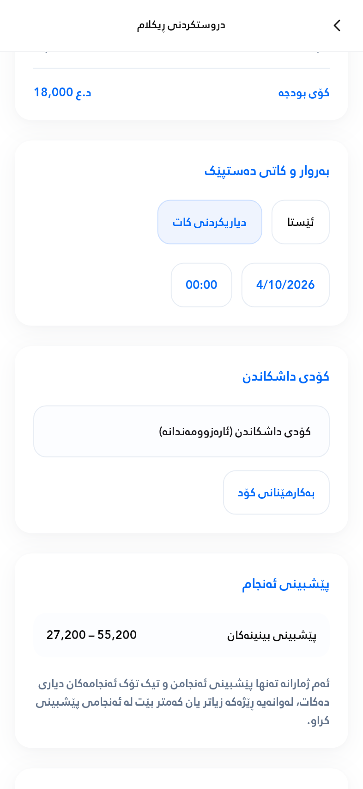
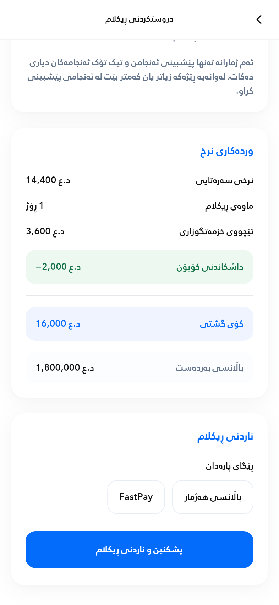

# Create Ad visual refinement

Implemented and checked on 2026-10-03 with Flutter 3.47.2. The existing nine-section structure and advertisement workflow are retained. PNGs are rendered from the actual Flutter widgets with test fixture data.

## Changes

| Area | Refinement |
| --- | --- |
| Cards and sections | White cards, softer layered shadows, 18 dp corner radius, consistent 20 dp internal padding and 22 dp between main sections. |
| Text arrangement | 20 dp between headings and content, 10 dp between labels and controls, and more space between targeting groups. Rabar, inherited sizes and w400 remain unchanged; no manual font-size or scaling changes. |
| Input fields | Light outlines, restrained surface tint, 14 dp corners and a 56 dp minimum normal field height. Dropdown insets account for their existing interactive child so normal fields align; long text can still grow. |
| Selection controls | Softer blue selected fill and outline, centered text, consistent 48 dp minimum height, natural text-based widths, 10 dp wrapping gaps and smooth state transitions. |
| Budget and duration | Refined blue tracks and thumbs, clearer values, supported min/max labels and better separation between the two sliders. Daily budget × days, supported steps, currency conversion and quotes are unchanged. |
| Forecast | Result ranges occupy a light panel, with more separation from provisional-assumption notes and the exact existing Kurdish disclaimer. CPM stays internal. |
| Pricing | More space between rows, a blue total panel and a separate readable available-balance row. Valid coupon discounts retain a light-green background and green text for both label and negative value. |
| Submission | More space after payment-method controls, a well-proportioned primary button and breathing room below it. Existing validation and confirmation navigation remain in place. |
| Scheduling | Exact options **ئێستا** and **دیاریکردنی کات**. Only one is selected. Future date/time controls appear with a subtle size transition and disappear for immediate scheduling. Switching options preserves the selected date/time. |
| Shared confirmation styling | Shared card/control refinements also keep confirmation visually consistent. Its immediate-start summary now uses **ئێستا**; countdown and financial processing behavior are unchanged. |

The label **ئێستا** retains the existing immediate/earliest-available backend scheduling behavior. It does not bypass campaign validation or publishing workflow.

## Verification performed

- Full Flutter test suite: **262 passed**.
- Create Ad/confirmation interaction and responsive tests: **65 passed** within that full suite.
- Existing nine-scenario responsive matrix: 240–1280 logical-pixel widths, portrait/landscape, 1–3× system text, display ratios 1–3, and safe insets. Keyboard/orientation, long dropdowns and short-landscape retry/cancellation checks pass.
- Normal text-field/dropdown heights align; actual budget/duration drag gestures update quotes without compounding totals.
- Exact scheduling labels, exclusive selection, picker visibility, chosen date/time retention across both options, and preservation through confirmation are tested.
- Incomplete future schedules cannot open confirmation or submit an ad.
- Coupon label/value highlights, invalid/expired coupons, total calculations, countdown cancellation/recovery and receipt/PDF regressions pass.
- Analysis of all changed Dart source/tests: **No issues found**.
- Flutter bundle for `linux-x64`: **built successfully**.
- PNGs reviewed for normal phone, tablet, scheduling and coupon pricing layouts.

No new live payment or signed-in physical-device run was performed. The existing local Android SDK limitation remains. No Supabase schema, RPC, pricing service, authentication or thumbnail architecture was changed by this refinement.

Reproduce:

```sh
flutter test --no-pub
flutter analyze --no-pub lib/screens/ad_create_screen.dart lib/screens/ad_confirmation_screen.dart lib/widgets/ad_form_components.dart test/ad_creation_flow_test.dart test/responsive_ad_ui_test.dart
flutter build bundle --no-pub --target-platform=linux-x64
```

## Updated previews







