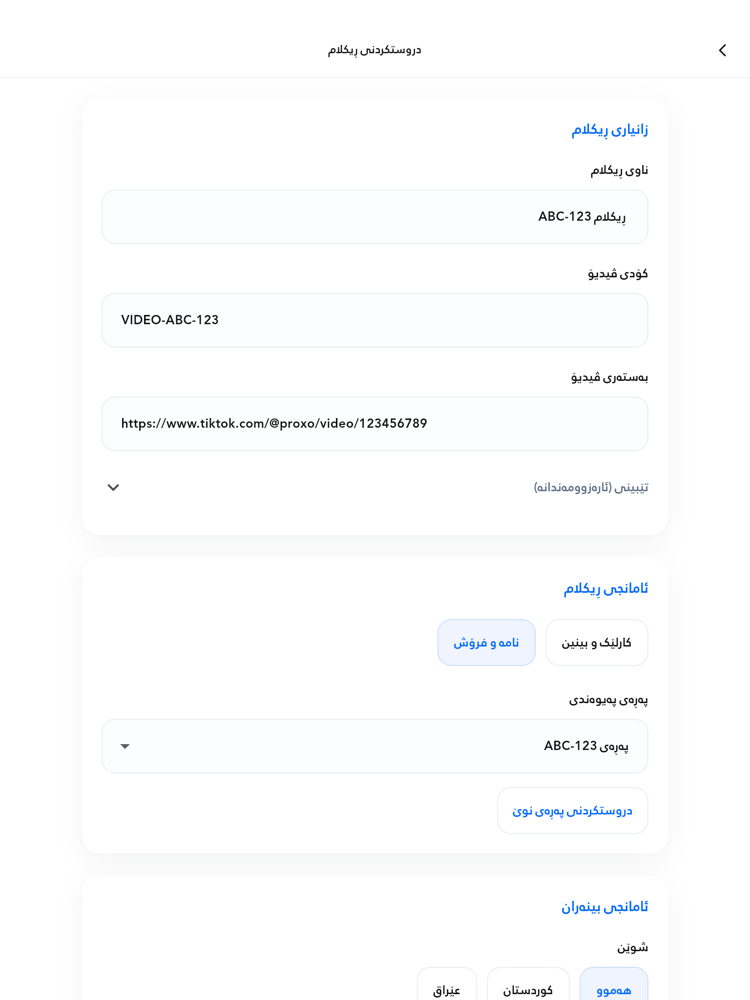
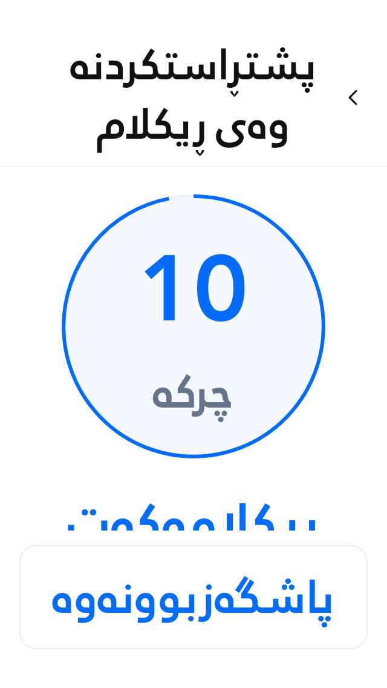
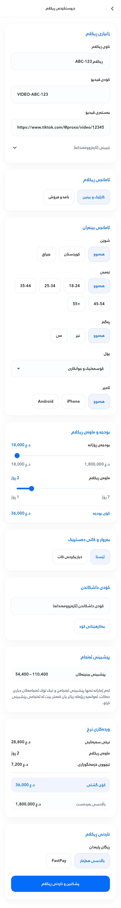

# Responsive Proxo advertisement UI

Verified with Flutter 3.47.2 on 2026-10-03. These checks cover the redesigned Create Ad and confirmation screens, transaction history, and the shared receipt layout/AppBar. Screenshots use actual Flutter widgets with test fixture data.

## Layout changes

- Create Ad, confirmation and transaction history respect landscape notch and side insets. Create Ad includes the bottom safe inset in its scroll padding.
- Contact-page names and category dropdowns grow to fit wrapped text. Selected contact names are no longer limited to two lines. Dropdown menus remain selectable with long Kurdish/Latin names and large system text.
- Pricing and summary rows switch from two columns to vertically arranged labels/values when their natural text width requires more room. The inherited Rabar typography, normal weight and bidirectional formatting remain intact.
- The countdown measures its inherited text, keeps a circular aspect ratio, and places its unit outside the circle when necessary. No font-size multiplier or font shrinking was introduced.
- Transaction cards honor large system text and wrap into a taller layout. Normal-size reference layouts remain unchanged.
- The confirmation cancellation button stays in a safe footer, limited to the same maximum content width as the cards. Retry appears in scrollable content so it cannot push cancellation or the AppBar off a short screen.
- Existing receipt proportions, currency formatting, price calculations, database integration and financial submission behavior are preserved.

## Tested layout matrix

Sizes are logical pixels; pixel ratio controls the simulated display resolution.

| Viewport | System text scale | Pixel ratio | Safe insets |
| --- | --- | --- | --- |
| 240 × 480 | 1 | 1 | None |
| 240 × 568 | 3 | 2 | Top 24, bottom 16 |
| 320 × 568 | 2 | 2 | Top 24, bottom 16 |
| 393 × 852 | 3 | 3 | Top 44, bottom 34 |
| 600 × 960 | 2 | 1.5 | Top 24, bottom 20 |
| 768 × 1024 | 1 | 2 | Top 24, bottom 20 |
| 1024 × 600 | 2 | 2 | Left 36, right 24 |
| 1280 × 800 | 1 | 1 | None |
| 640 × 320 | 2 | 3 | Left 44, right 20, bottom 16 |

Each matrix entry exercises Create Ad, confirmation, transaction history and receipts. Create Ad scrolls through information, targeting, budget, coupons and submission. Assertions check rendering exceptions, visible text height/line clipping, safe horizontal bounds and cancellation accessibility. The countdown remains square and cancellation makes zero repository submissions. Existing receipt reference-coordinate and PDF tests also pass.

Additional checks exercise a long contact-page dropdown at 320 × 568 with 3× text; keyboard visibility and orientation changes with retained input; and failure/retry/cancellation at 640 × 320 with 3× text.

## Actual verification

| Check | Result |
| --- | --- |
| Full Flutter test suite | 262 passed after the UI refinement |
| Responsive widget suite | 33 passed, including two screenshot renders and a field/slider gesture check |
| Analysis of changed source and tests | No issues found |
| Whole-project analysis | No errors; 303 existing warning/info diagnostics in other files |
| Flutter bundle for linux-x64 | Built successfully |
| Android debug APK attempt | Blocked: Android SDK is unavailable locally |
| Visual review | Tablet form, large-text confirmation and refreshed full form PNGs inspected |

No physical-device or signed-in production payment run was performed for this layout update. Widget tests use a controlled repository; these results do not claim new live Supabase/payment verification. The finite matrix covers small phones, larger phones, tablets, desktop-sized viewports, landscape, safe insets, display densities and large text; it is not a claim that every possible device was tested.

Reproduce:

```sh
flutter test --no-pub
flutter analyze --no-pub lib/screens/ad_create_screen.dart lib/screens/ad_confirmation_screen.dart lib/widgets/ad_form_components.dart lib/widgets/receipt/receipt_kit.dart lib/widgets/receipt/tx_history_layout.dart test/responsive_ad_ui_test.dart test/receipt_layout_test.dart test/tx_history_layout_test.dart
flutter build bundle --no-pub --target-platform=linux-x64
```

## Flutter-rendered previews

The current spacing, controls and scheduling labels are documented in [Create Ad UI refinement](CREATE_AD_UI_REFINEMENT.md).






