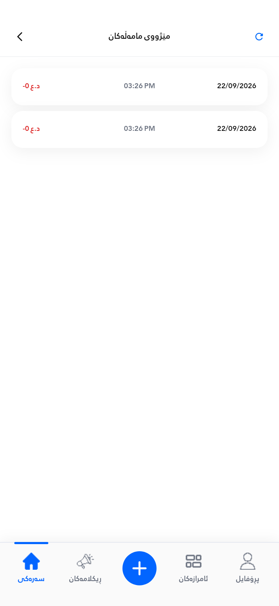

# Transaction history design

`tx_history_page.dart` uses the shared receipt design through `TxHistoryLayout`
and `TxHistoryCard`.

| Element | Design |
| --- | --- |
| Page and card background | White, `#FFFFFF` |
| Font | Rabar, Flutter `FontWeight.w400` |
| App bar title | 13 dp, centered, `#111111` |
| App bar and controls | 56 dp plus status inset; 44 × 44 dp tap targets |
| Back / refresh | Back on the left; blue refresh on the right |
| Page direction | LTR; Kurdish and Arabic title/state text keeps RTL reading direction |
| Row order | Amount on the left, time in the center, date on the right |
| Row text | 11 dp; numbers explicitly LTR |
| Cards | 16 dp radius and padding, shared receipt shadow |
| List | 16 dp outer gutter and top inset; 8 dp between cards |
| Accessibility text scale | 1.0–1.3, matching receipt detail |
| Bottom navigation | Removed from Transaction History; other screens keep their navigation |

Loading rows match the finished cards. Refresh is disabled while loading or
refreshing, and shows a spinner during refresh. Language changes update an open
history page. Transaction queries, amounts, balances and detail routes retain
their existing behavior. The AppBar back button returns to the existing shell.

Validation: 226 widget/model/PDF tests passed, including narrow screens, larger
text, Kurdish and Arabic titles, long amounts, loading placeholders, and button
callbacks. The complete verification report is in `AD_CREATION_IMPLEMENTATION.md`.

The preview is rendered from the production widgets at 393 × 852 dp, 2× raster
scale, with the two sample rows from the supplied screenshot. The test harness
does not draw native Android status-bar content.

